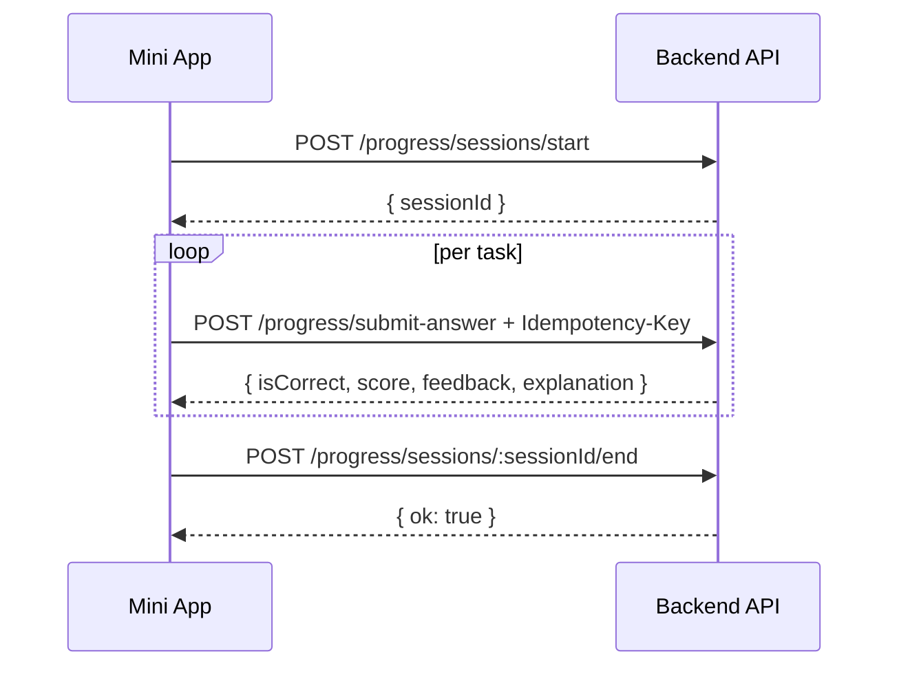

# Progress Runtime API (Authoritative Lesson Flow)

## Purpose
Defines the canonical runtime flow for lesson execution. Frontend must use this flow to ensure progress, XP, and prerequisite enforcement are server-authoritative.

## Auth
All endpoints below require JWT (`Authorization: Bearer <token>`).

## Runtime Sequence
1. Start session
2. Submit each answer (server validates)
3. End session



---

## 1) POST /progress/sessions/start
Starts a learning session.

### Request
```json
{
  "moduleRef": "a0.basics",
  "lessonRef": "a0.basics.001",
  "source": "home"
}
```

### Response
```json
{
  "sessionId": "67d5f4e2b13a0f4f7b8d1234"
}
```

---

## 2) POST /progress/submit-answer
Validates answer on server and records attempt.

### Required header
- `Idempotency-Key: <uuid-or-unique-string>`

### Request
```json
{
  "lessonRef": "a0.basics.001",
  "taskRef": "a0.basics.001.t1",
  "userAnswer": "[\"What\",\"time\",\"is\",\"it\",\"?\"]",
  "durationMs": 1200,
  "sessionId": "67d5f4e2b13a0f4f7b8d1234",
  "lastTaskIndex": 5,
  "isLastTask": false
}
```

### Response
```json
{
  "attemptId": "67d5f57ab13a0f4f7b8d9abc",
  "isCorrect": true,
  "score": 1,
  "feedback": "Great",
  "correctAnswer": "What time is it ?",
  "explanation": "Correct word order"
}
```

### Error examples
- `403 PREREQ_NOT_MET`
- `400 invalid answer format`
- `404 lesson/task not found`

---

## 3) POST /progress/sessions/:sessionId/end
Ends session and finalizes aggregates.

### Request
```json
{
  "extraXp": 0
}
```

### Response
```json
{
  "ok": true
}
```

---

## Notes
- Client should not compute authoritative correctness locally.
- Client may show optimistic UI, but final state comes from `submit-answer` response.
- For retries/network errors, reuse the same `Idempotency-Key` per logical attempt.
